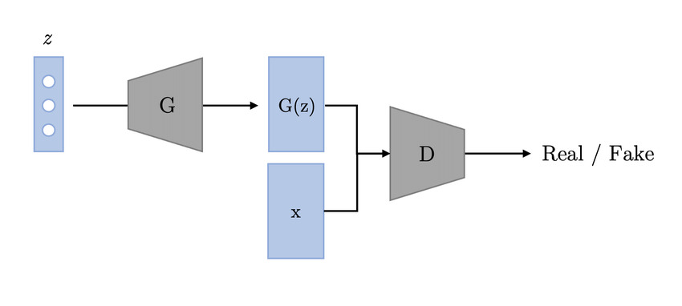
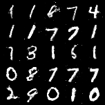
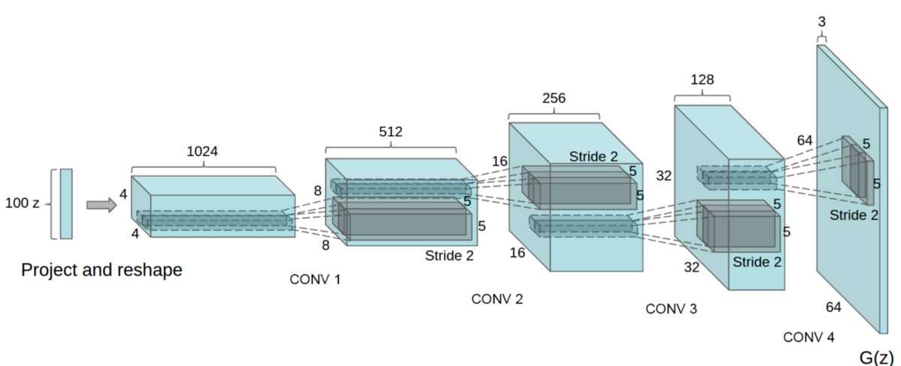
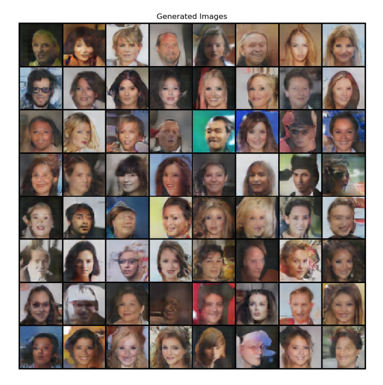

## Simple Generative Adverserial Network

##### PyTorch implementation of GAN introduced in the paper <a href="https://arxiv.org/abs/1406.2661">Generative Adversarial Networks</a> Ian J. Goodfellow, Jean Pouget-Abadie, Mehdi Mirza, Bing Xu, David Warde-Farley, Sherjil Ozair, Aaron Courville, Yoshua Bengio
 

### Introduction

##### Generative Adversarial Networks (GANs) are one of the most popular (and coolest) Machine Learning algorithms developed in recent times. They belong to a set of algorithms called generative models, which are widely used for unupervised learning tasks which aim to learn the uderlying structure of the given data. As the name suggests GANs allow you to generate new unseen data that mimic the actual given real data. However, GANs pose problems in training and require carefullly tuned hyperparameters.

### Result of Simple GAN after training

 

## Deep Convolutional GAN

##### PyTorch implementation of DCGAN introduced in the paper: <a href="https://arxiv.org/abs/1511.06434">Unsupervised Representation Learning with Deep Convolutional Generative Adversarial Networks</a>, Alec Radford, Luke Metz, Soumith Chintala.

### Introduction

##### DCGAN is one of the most popular and succesful network design for GAN. It mainly composes of convolution layers without max pooling or fully connected layers. It uses strided convolutions and transposed convolutions for the downsampling and the upsampling respectively.

### Generator Architecture of DCGAN

### Result of Simple GAN after training

